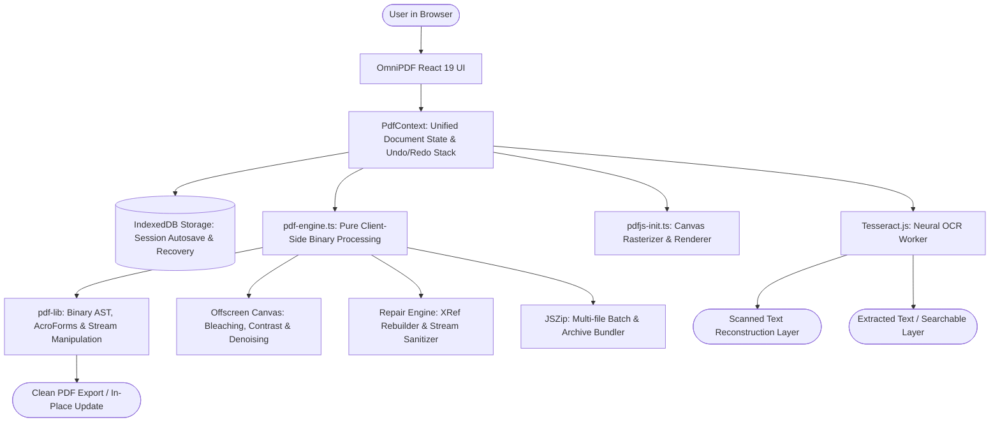

# OmniPDF Architecture & Technical Design

OmniPDF is a high-performance, browser-native PDF workspace built to provide complete document manipulation, viewing, editing, scanning, OCR, repair, form filling, and conversion capabilities with zero server dependencies.

---

## 1. High-Level System Architecture

---

## 2. Core Architectural Principles

### 2.1 The "Continuous In-Place Workspace" Model
Traditional PDF web tools force users into a disconnected, multi-page funnel:
`Upload -> Process -> Force Download -> Re-upload -> Process`.

OmniPDF operates on a **Continuous Document Workspace**:
- Once a file is loaded or captured via the webcam scanner, its binary buffer resides in `PdfContext`.
- Any operation (e.g. rotating pages, burning redactions, adding Bates numbers, filling forms, repairing structures) performs an in-place update via `updateActiveDocument(newBytes, operationName)`.
- The document snapshot is automatically pushed to the **Undo/Redo Stack**, allowing the user to seamlessly undo or redo any operation up to 15 history states.
- Users can switch between Organize, Edit, Sign, Watermark, Compress, Forms, and Health Audit without ever re-uploading the file.

### 2.2 IndexedDB Autosave & Instant Session Recovery
- Instead of using `localStorage` (which throws `QuotaExceededError` on PDFs larger than ~5MB), OmniPDF uses a dedicated **IndexedDB storage layer** (`src/lib/storage/indexed-db.ts`).
- Large binary `ArrayBuffer` instances are stored directly in an IndexedDB object store with timestamps.
- If a user accidentally refreshes their tab or closes the browser, OmniPDF detects the saved session on startup and presents a non-intrusive 1-click restore banner.

### 2.3 100% Client-Side In-Browser Privacy
- Zero backend API or proxy server is required.
- Files are parsed via standard `ArrayBuffer` and `Uint8Array` primitives.
- All operations execute in memory sandboxes; `URL.createObjectURL` references are systematically revoked after download.

---

## 3. Deep Dive into Specialized Engines

### 3.1 Scanned PDF Text Editing & Reconstruction (`ScannedTextEditor.tsx`)
Editing text in a scanned PDF cannot be solved with standard PDF string replacement, because scanned PDFs are pure bitmap images. OmniPDF solves this using a **Level 4 Hybrid Reconstruction Pipeline**:
1. **High-DPI Rasterization**: Renders the scanned page onto an offscreen canvas at high resolution.
2. **Neural Bounding Box Detection**: Runs Tesseract.js OCR with word and line coordinates (`bbox: { x0, y0, x1, y1 }`).
3. **Interactive Visual Overlay**: Renders click-to-edit boundaries over every word or sentence on the page.
4. **Tone-Matched Raster Patch**: When text is edited, an opaque background patch matching the surrounding page tone is drawn over the original bitmap bounding box.
5. **Precision Typography Overlay**: The replacement text is drawn in place matching font family, weight, size, and ink color.
6. **Binary Page Replacement**: The reconstructed canvas is compiled and replaces the target page in the active PDF binary in-place.

### 3.2 Interactive Forms & AcroForms Engine (`FormWorkspace.tsx`)
- Detects existing interactive AcroForm fields (text fields, checkboxes, dropdowns, radio buttons) using `PDFDocument.getForm()`.
- Provides an interactive field filler with instant live document preview.
- **Form Flattening**: Permanently burns form entries into page appearance streams so they can no longer be edited or stripped by downstream readers.
- **Form Builder**: Allows users to dynamically inject new interactive text fields, checkboxes, or dropdown selectors onto any page with custom coordinates.

### 3.3 Fault-Tolerant PDF Repair Engine (`PdfRepairWorkspace.tsx`)
- Handles malformed, damaged, or corrupted PDFs that cause standard viewers to display blank pages or fail to open.
- **Cross-Reference Rebuilding**: Scans for valid object dictionaries and reconstructs missing or damaged `/XRef` tables.
- **Stream Reserialization**: Isolates broken or unreferenced object pointers, removes circular references, and re-encodes clean streams.
- **Diagnostic Audit Log**: Emits step-by-step diagnostic information detailing structural anomalies found and fixed.

### 3.4 Multi-Step Guided Workflows (`WorkflowsWorkspace.tsx`)
- Provides guided pipelines for complex multi-operation routines:
  - *Scan & Clean & OCR & Edit*: Capture camera/upload -> Bleach background -> Extract text -> Edit scanned typos.
  - *Sign & Secure Contract*: Fill fields -> Place digital signature -> Burn redactions -> Strip metadata.
  - *Audit & Optimize & Archive*: Run health audit -> Compress to target DPI -> Clean headers -> Export.

---

## 4. State Management (`src/context/PdfContext.tsx`)

| State Property | Description |
| :--- | :--- |
| `currentFile` | Metadata and `ArrayBuffer` of the active working PDF document |
| `pages` | Array of `PdfPageItem` containing IDs, rotation offsets, aspect ratios, and thumbnails |
| `selectedPageIds` | Set of currently selected page IDs for batch operations |
| `savedSession` | Auto-saved session metadata retrieved from IndexedDB |
| `undoStack` / `redoStack` | Complete history snapshots of `PdfFileInfo` and `PdfPageItem[]` |
| `processing` | Status indicators (`idle`, `reading`, `processing`, `success`, `error`) and progress bar % |
| `healthReport` | Result of diagnostic analysis including blank pages and compliance checks |

---

## 5. Verification & Testing Strategy
- Unit & Binary verification via `scripts/test-engine.mjs` verifying:
  - Page deletion, rotation, reordering, duplication
  - Page extraction and multi-file merging
  - Single-page splitting and custom range splitting
  - ZIP archive generation
  - Blank page insertion and order reversal
  - Watermark and Bates stamping
  - Metadata sanitization and Text-to-PDF compilation
- Type integrity verified via `tsc -b` and production bundling verified via `vite build`.
