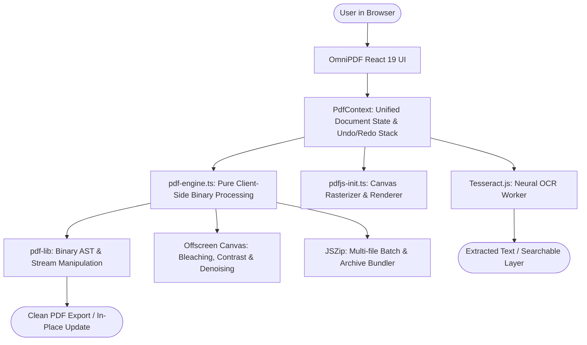

# OmniPDF Architecture & Technical Design

OmniPDF is a high-performance, browser-native PDF workspace built to provide complete document manipulation, viewing, editing, scanning, OCR, and conversion capabilities with zero server dependencies.

---

## 1. High-Level System Architecture

---

## 2. Core Architectural Principles

### 2.1 The "Continuous In-Place Workspace" Model
Traditional PDF web tools force users into a disconnected, multi-page funnel:
`Upload -> Process -> Force Download -> Re-upload -> Process`.

OmniPDF operates on a **Continuous Document Workspace**:
- Once a file is loaded or captured via the webcam scanner, its binary buffer resides in `PdfContext`.
- Any operation (e.g. rotating pages, burning redactions, adding Bates numbers, compressing streams) performs an in-place update via `updateActiveDocument(newBytes, operationName)`.
- The document snapshot is automatically pushed to the **Undo/Redo Stack**, allowing the user to seamlessly undo or redo any operation.
- Users can switch between Organize, Edit, Sign, Watermark, Compress, and Health Audit without ever re-uploading the file.

### 2.2 100% Client-Side In-Browser Privacy
- Zero backend API or proxy server is required.
- Files are parsed via standard `ArrayBuffer` and `Uint8Array` primitives.
- All operations execute in memory sandboxes; `URL.createObjectURL` references are systematically revoked after download.

---

## 3. Module Breakdown

### 3.1 PDF Binary Engine (`src/lib/pdf/pdf-engine.ts`)
Handles binary manipulation using `pdf-lib`:
- **Page Manipulation**: Reordering, rotation, deletion, duplication, blank page insertion, document insertion, and page reversal.
- **Watermarking & Numbering**: Scalable text stamps, image logos with opacity, sequential page numbering (`Page X of Y`), and legal Bates numbering (`DOC-000001`).
- **Annotation & Redaction Burner**: Overlays text, highlighters, whiteouts, and permanent blackouts directly into the PDF content stream. Redactions rasterize the underlying bounding boxes so sensitive text cannot be selected or copied.
- **Compression**: Resamples photographic images to specified target DPI (72, 96, 144) and JPEG quality, strips unreferenced dictionary objects, and compresses PDF content streams.
- **Metadata Sanitizer**: Scrubs XMP metadata, creator IDs, producer signatures, and resets timestamps.
- **Document Health Diagnostic**: Evaluates average page weight, PDF specification version, font glyph searchability, and detects blank pages.

### 3.2 View & Rasterization Pipeline (`src/lib/pdf/pdfjs-init.ts`)
- Configured with client-side Web Worker (`pdf.worker.min.js`).
- Dynamic scale calculation for high-DPI screens (Retina displays).
- Efficient canvas recycling and thumbnail rendering with debouncing.

### 3.3 Document Scanner & Camera Pipeline (`src/components/scanner/DocumentScanner.tsx`)
- Accesses camera stream via `navigator.mediaDevices.getUserMedia`.
- Client-side pixel shaders executed on HTML5 `<canvas>`:
  - **Magic Clean Paper Bleaching**: Dynamically thresholds background gray paper tints while preserving ink strokes.
  - **High-Contrast B&W Binarization**: Converts color photographs into clean, lightweight black-and-white documents.
  - **Brightness & Contrast Adjustments**: Corrects uneven shadows and lighting gradients.

### 3.4 Neural OCR Engine (`src/components/ocr/OcrWorkspace.tsx`)
- Powered by `tesseract.js` running in dedicated browser web workers.
- Supports English, Spanish, French, German, Italian, and Chinese Simplified.
- Dual-mode extraction:
  - Instant extraction of embedded font glyphs for digital PDFs (< 100ms).
  - Neural visual character recognition for scanned photos and paperwork.

---

## 4. State Management (`src/context/PdfContext.tsx`)

| State Property | Description |
| :--- | :--- |
| `currentFile` | Metadata and `ArrayBuffer` of the active working PDF document |
| `pages` | Array of `PdfPageItem` containing IDs, rotation offsets, aspect ratios, and thumbnails |
| `selectedPageIds` | Set of currently selected page IDs for batch operations |
| `undoStack` / `redoStack` | Complete history snapshots of `PdfFileInfo` and `PdfPageItem[]` |
| `processing` | Status indicators (`idle`, `reading`, `processing`, `success`, `error`) and progress bar % |
| `healthReport` | Result of diagnostic analysis including blank pages and compliance checks |

---

## 5. Verification & Testing Strategy
- Unit & Binary verification via `scripts/test-engine.mjs` verifying:
  - Page deletion, rotation, reordering, duplication
  - Page extraction and multi-file merging
  - Single-page splitting and custom range splitting
  - ZIP archive generation
  - Blank page insertion and order reversal
  - Watermark and Bates stamping
  - Metadata sanitization and Text-to-PDF compilation
- Type integrity verified via `tsc -b` and production bundling verified via `vite build`.
